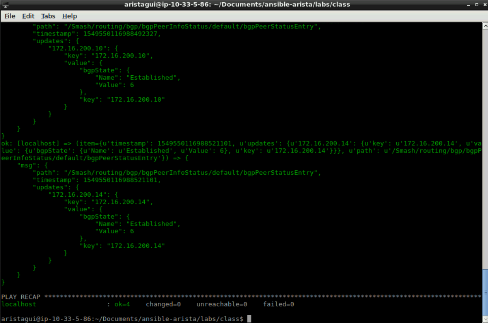

Exercise 10 - CVP Get BGP Status
================================

In the previous exercise, we wrote a playbook using CloudVision's APIs.  In this exercise, we will write a playbook that calls CVP's Telemetry API.  This playbook will only be ran against ``spine1``, which is defined in the variable ``{{ switch_sn }}`` in the ``group_vars/all.yml`` file. 

1. In **Atom** create a new file with the following information, and save it as ``get-cvp-bgp.yml``

    .. code-block:: yaml

        ---
        - hosts: localhost
          gather_facts: yes
          connection: local
          tasks:
            - name: Setup REST API Session
              uri:
                url: "{{ cvp_base_url }}/cvpservice/login/authenticate.do"
                method: POST
                validate_certs: no
                headers: 
                  Accept: "application/json"
                  Content-Type: "application/json"
                body_format: "json"
                body:
                  userId: "{{ ansible_user }}"
                  password: "{{ ansible_password }}"
                force_basic_auth: yes
                status_code: 200,201
              register: login

            - name: Get BGP Status
              uri:
                url: "{{ cvp_base_url }}/api/v1/rest/{{ switch_sn }}/Smash/routing/bgp/bgpPeerInfoStatus/default/bgpPeerStatusEntry"
                method: GET
                validate_certs: no
                return_content: yes
                headers:
                  Cookie: "{{ login.set_cookie }}"
              register: bgp_status
          
            - debug:
                msg: "{{ item }}"
              loop: "{{ bgp_status.json.notifications }}"    
 

.. note::
    This playbook is only going to output the data to the screen so we can see the results.  To further extend this, the data can be registered to a variable to be used later on.  For example, perform an action based on BGP peer status.

2. Now within **Terminal** we will run this playbook.

    .. code-block:: text
    
        ansible-playbook get-cvp-bgp.yml
    

|

**Section Complete!**
