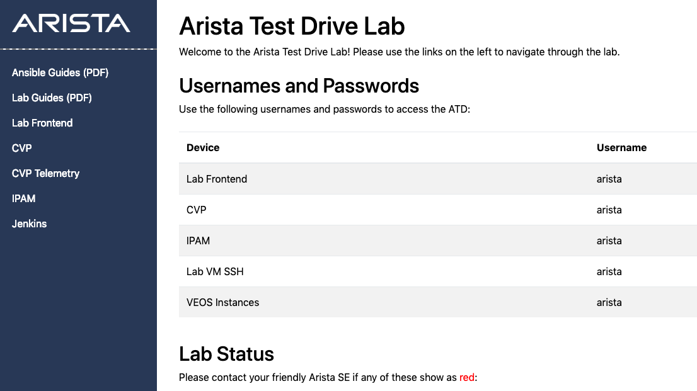
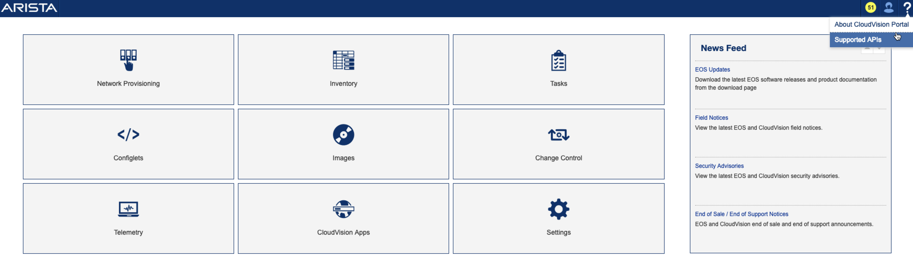
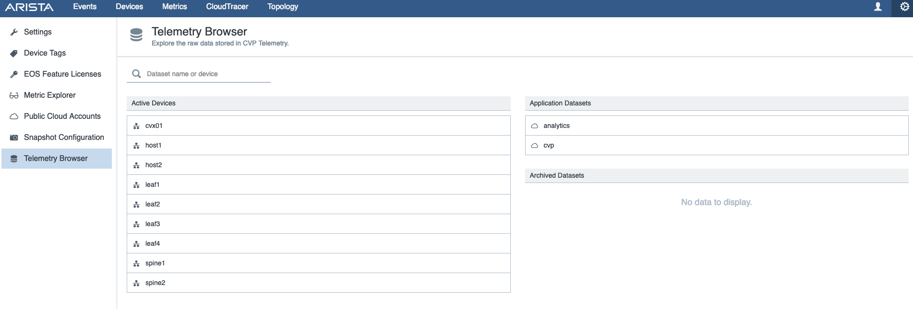
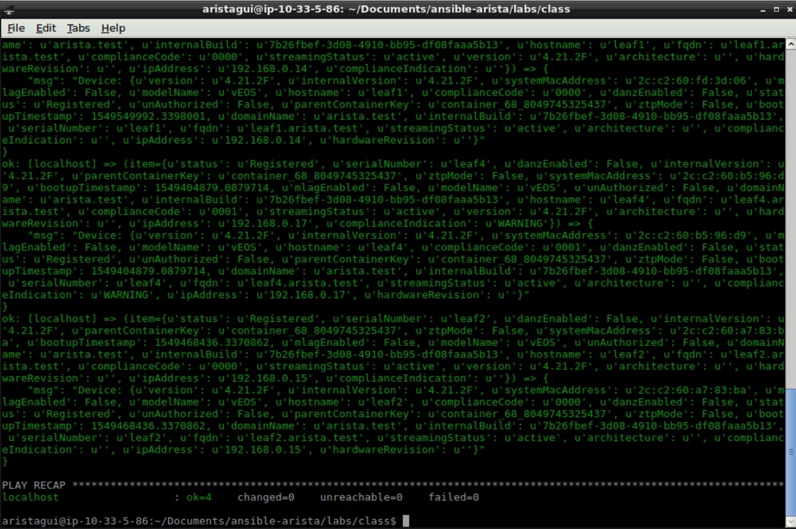

Exercise 9 - CVP Get Devices
============================

To showcase the power of using Ansible, we can also make playbooks to interact with CloudVision Portal.  This can be done by leveraging the well-documented APIs.  To access CVP in the Lab, click on ``CVP`` located in the left menu-bar on the **Topology Landing** page.

|

To help get familiarized with the different API calls, on the CVP landing page, click the ``?`` icon and select **Supported APIs**

|

Those API calls are great for managing switches, configlets, images and image bundlers, but what if we could access all of the streaming Telemetry data that CVP collects from all of our devices? That would be very powerful and a centralized location to script against. What if I told you that there are APIs to access **NetDB**, the centralized database that gathers SysDB information from the switches.

To see the Telemetry information available, starting from the **CVP Landing Page**:
    1. Select **Telemetry**
    2. Click on the **Gear** icon in the upper-right corner of the screen
    3. Then select **Telemetry Browser** on the left side
    4. From here you can select a switch to explore all of the Telemetry data

|

Now let's start building some Ansible playbooks for CVP!  The previously mentioned API documentation will help build our API calls.  This first playbook we will create queries CVP and grabs all of the information on each device.

1. Back in our **Atom** program on the DevBox, create a new file with the following information, and save it as ``get-cvp-devices.yml`` Notice the ``hosts`` parameter? Since we are making external API calls, this playbook can be ran locally.

    .. code-block:: yaml

        ---
        - hosts: localhost
          gather_facts: yes
          connection: local
          tasks:
            - name: Setup REST API Session
              uri:
                url: "{{ cvp_base_url }}/cvpservice/login/authenticate.do"
                method: POST
                validate_certs: no
                headers: 
                  Accept: "application/json"
                  Content-Type: "application/json"
                body_format: "json"
                body:
                  userId: "{{ ansible_user }}"
                  password: "{{ ansible_password }}"
                force_basic_auth: yes
                status_code: 200,201
              register: login

            - name: Get list of devices
              uri:
                url: "{{ cvp_base_url }}/cvpservice/inventory/devices"
                method: GET
                validate_certs: no
                return_content: yes
                headers:
                  Cookie: "{{ login.set_cookie }}"
              register: switch_list
        
            - debug:
                msg: "{{ item }}"
              loop: "{{ switch_list.json }}"    

.. note::
    This playbook is only going to output the data to the screen so we can see the results.  To further extend this, the data can be registered to a variable to be used later on.  For example switch serial numbers.

2. Now within **Terminal** we will run this playbook.

    .. code-block:: text
    
        ansible-playbook get-cvp-devices.yml
    

|

**Section Complete!**
