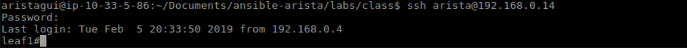
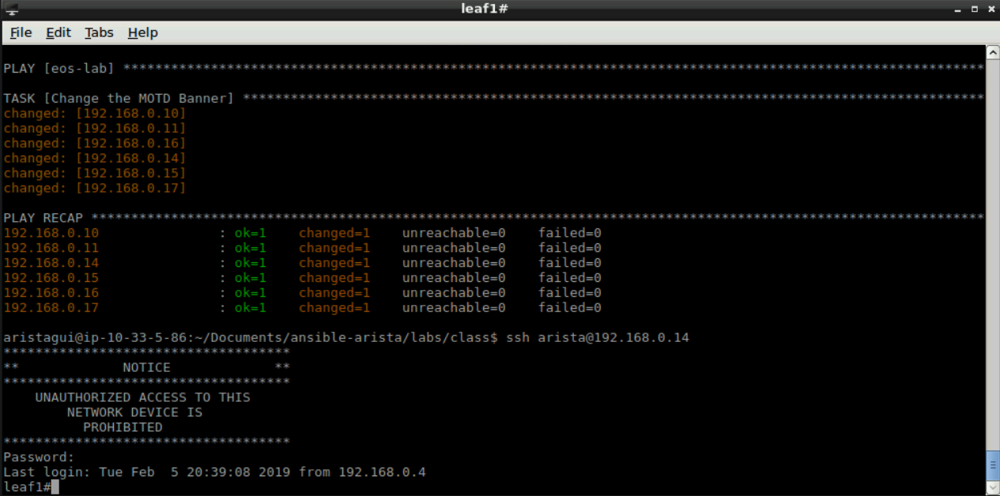

Exercise 5 - EOS Banner
=======================

1. Next we will go over the **eos_banner** module.  This module allows the login banner for the switch to be updated/modified from a playbook.

2. Create a new file with the following information, and save it as ``add-banner.yml``

    .. code-block:: yaml

        ---
        - hosts: eos-lab
          gather_facts: false
          tasks:
            - name: Change the MOTD Banner
              eos_banner:
                banner: login
                text: |
                    ************************************
                    **             NOTICE             **
                    ************************************
                        UNAUTHORIZED ACCESS TO THIS 
                            NETWORK DEVICE IS 
                                PROHIBITED
                    ************************************
                state: present

.. note::
    You can put your own login message for the text parameter in ``eos_banner``.

3. Before we run this playbook, in **Terminal** let's login to a switch to see the current state of the login banner. username: ``arista`` password: ``arista``

    .. code-block:: text

        ssh arista@192.168.0.14
        exit

|

4. Now within **Terminal** we will run this playbook.

    .. code-block:: text
    
        ansible-playbook add-banner.yml
    
5. Now let's login to the switch to see if the was created.

    .. code-block:: text

        ssh arista@192.168.0.14
        exit

|

**Section Complete!**
