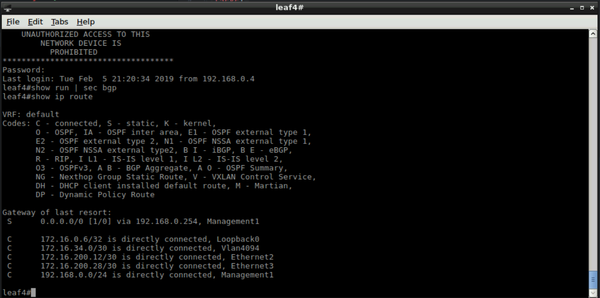
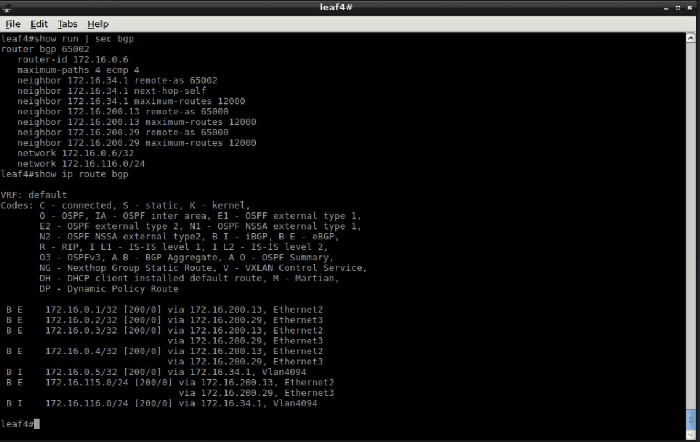

Exercise 8 - EOS BGP Configuration
==================================

1. For this exercise we will use the **eos_config** module again.

2. First we will need to create a new Jinja2 template.  Add the following ad save it as ``bgp.j2``

    .. code-block:: text

        router bgp {{ bgp_as }}
        
        
           router-id {{ intf.ipaddress }}
           network {{ intf.ipaddress }}/{{ intf.mask }}
        
        
           maximum-paths 4 ecmp 4
        
           neighbor {{ neighbor.ip }} remote-as {{ neighbor.remote_as }}
        
           neighbor {{ neighbor.ip }} next-hop-self
        
           neighbor {{ neighbor.ip }} maximum-routes 12000
        
        
           network 172.16.116.0/24

.. note::
    In the ``bgp.j2`` file, it is parsing through the ``host_vars/192.168.0.17.yml`` file.  First it sets the BGP AS number, then it loops through all of the configured interfaces for the ``Loopback0`` interface.  Which will be used as the ``router-id``.  It then loops through all BGP neighbors specified and adds the appropriate BGP neighbor statements.

2. Create a new file with the following information, and save it as ``add-bgp.yml``

    .. code-block:: yaml

        ---
        - hosts: 192.168.0.17
          gather_facts: false
          tasks:
            - name: Apply BGP Configuration to Leaf4
              eos_config:
                src: bgp.j2
                defaults: yes
                save_when: modified

.. note::
    Like the ``add-l3-2.yml`` file, only the ``bgp.j2`` Jinja2 file needs to specified as a source within the playbook.

3. Before we run this playbook, in **Terminal** let's login to see the BGP state configured on leaf4. username: ``arista`` password: ``arista``

    .. code-block:: text

        ssh arista@192.168.0.17
        show run | sec bgp
        show ip route
        exit

|

4. Now within **Terminal** we will run this playbook.

    .. code-block:: text
    
        ansible-playbook add-bgp.yml
    
5. Now let's login to the switch to see if the was created.

    .. code-block:: text

        ssh arista@192.168.0.17
        show run | sec bgp
        show ip route bgp
        exit

|

**Section Complete!**
