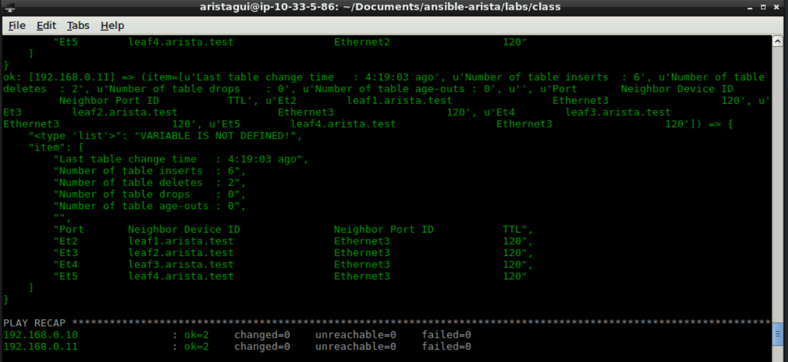
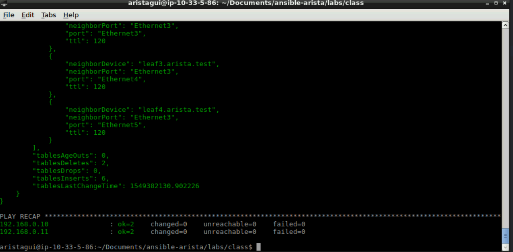

Exercise 3 - EOS Commands
=========================

1. Next we will go over the **eos_command** module.  This module allows EOS CLI commands to be ran from within a playbook.

2. Create a new file with the following information, and save it as ``show-lldp.yml``

    .. code-block:: yaml

        ---
        - hosts: spines
          gather_facts: false
          tasks:
            - name: Get LLDP Neighbor Information
              eos_command:
                commands: show lldp neighbors
              register: lldp_info
            - name: Output LLDP Information
              debug:
                var: "{{ item }}"
              loop: "{{ lldp_info.stdout_lines }}"

3. Now within **Terminal** we will run this playbook.

    .. code-block:: text

        ansible-playbook show-lldp.yml

.. note::    
  Notice the output of playbook? Each line of information is a string, and not an easy to work with json format.  

4. Let's duplicate ``show-lldp.yml`` as a new file ``show-lldp-2.yml``.  We will modify the **eos_command** section for this playbook to specify that we would like to get json data in return.

    .. code-block:: yaml

        ---
        - hosts: spines
          gather_facts: false
          tasks:
            - name: Get LLDP Neighbor Information
              eos_command:
                commands: 
                - command: show lldp neighbors
                  output: json
              register: lldp_info
            - name: Output LLDP Information
              debug:
                var: "{{ item }}"
              loop: "{{ lldp_info.stdout_lines }}"

5. Now within **Terminal** we will run this playbook.

    .. code-block:: text

        ansible-playbook show-lldp-2.yml

.. note::
  Notice the output is now in a familiar json data format.  

**Section Complete!**
