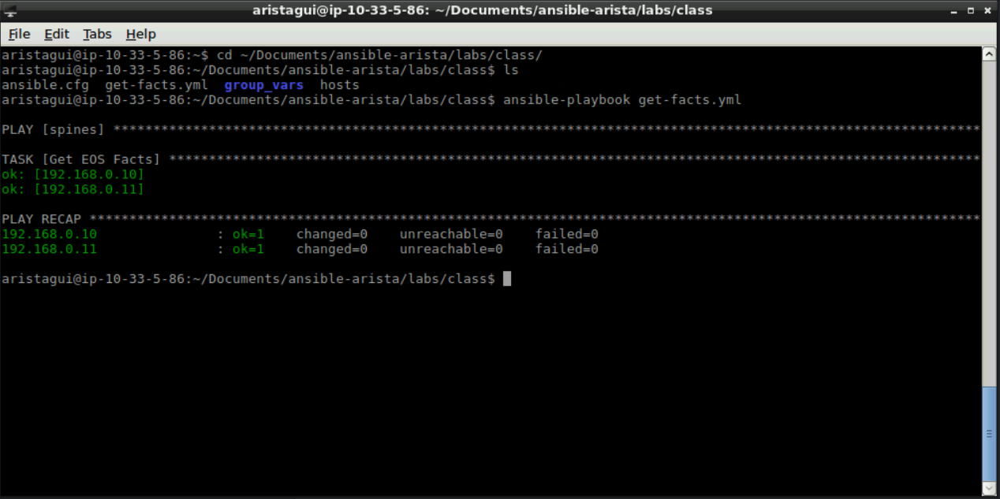
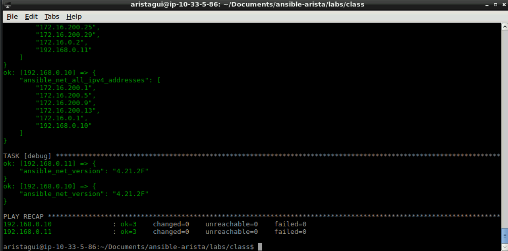

Exercise 2 - EOS Facts
======================

1. It's time to create our first playbook.  This one we will use the **eos_facts** module to get information about our EOS devices.

|

2. Create a new file with the following information, and save it as **get-facts.yml**

    .. code-block:: yaml

        ---
        - hosts: spines
          gather_facts: false
          tasks:
            - name: Get EOS Facts
              eos_facts:
       
|

3. Next go to your **Terminal** window, and make sure you are in the following directory. **~/Documents/ansible-arista/labs/class**

    .. code-block:: text

        cd ~/Documents/ansible-arista/labs/class

|

4. Next we will start our ansible-playbook with the following command.

    .. code-block:: text

        ansible-playbook get-facts.yml

That didn't provide us with much information.  Let's try that again with adding **-vvv** to the command.

    .. code-block:: text

        ansible-playbook get-facts.yml -vvv

Now that provided us with more information.

|

5. Let's create another playbook, but this time we will grab information from the **eos_facts**

|

6. Create a new file with the following information, and save it as **get-facts2.yml**

    .. code-block:: yaml

        ---
        - hosts: spines
          gather_facts: false
          tasks:
            - name: Get EOS Facts
              eos_facts:
            
            - debug:
                var: ansible_net_all_ipv4_addresses

            - debug:
                var: ansible_net_version

|

7. Now we will start our ansible-playbook with the following command.

    .. code-block:: text

        ansible-playbook get-facts2.yml

    We will see debug output showing us any IPv4 addresses configured on the devices, as well as the EOS versions of each switch.

|

Section Complete!