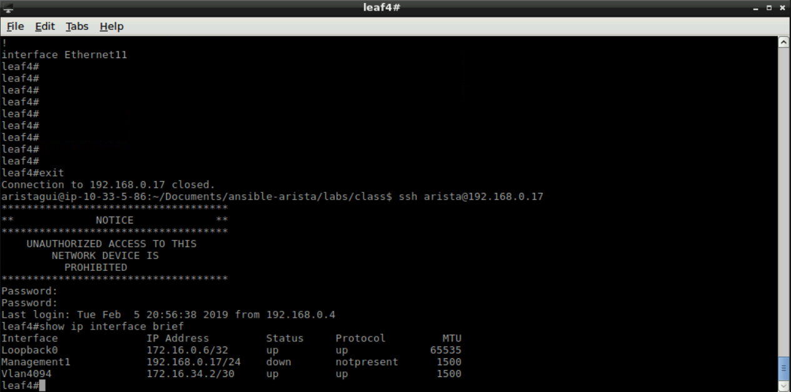
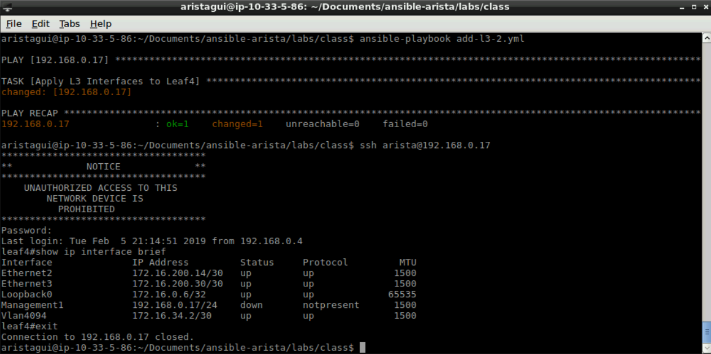

Exercise 7 - EOS L3 Interfaces (Continued)
==========================================

1. Next we will go over the **eos_config**.  This module allows us to directly input configuration information into the running-config from a playbook.

|

2. For this playbook, we will introduce the use of a Jinja2 template.  Jinja2 templates help reduce the amount of configurations that need to be typed ahead of time.  This is acheived by looping through a set of variables for the task.  Let's start by creating a new file with the following information, and save it as **l3-intf.j2**

    .. code-block:: text

        
        interface {{ intf.name }}
        
           no switchport
        
           ip address {{ intf.ipaddress }}
                

|

3. Create a new file with the following information, and save it as **add-l3-2.yml**

    .. code-block:: yaml

        ---
        - hosts: 192.168.0.17
        gather_facts: false
        tasks:
            - name: Apply L3 Interfaces to Leaf4
              eos_config:
                src: l3-intf.j2
                defaults: yes
                save_when: modified

|

4. Before we run this playbook, in **Terminal** let's login to a switch to see the current IP addreses configured on leaf4. username: arista / password: arista

    .. code-block:: text

        ssh arista@192.168.0.17
        show ip interface brief
        exit

|

5. Now within **Terminal** we will run this playbook.

    .. code-block:: text
    
        ansible-playbook add-l3-2.yml
    
6. Now let's login to the switch to see if the was created.

    .. code-block:: text

        ssh arista@192.168.0.17
        show ip interface brief
        exit

Now all interfaces show up with the correct IP Address!

|

Section Complete!