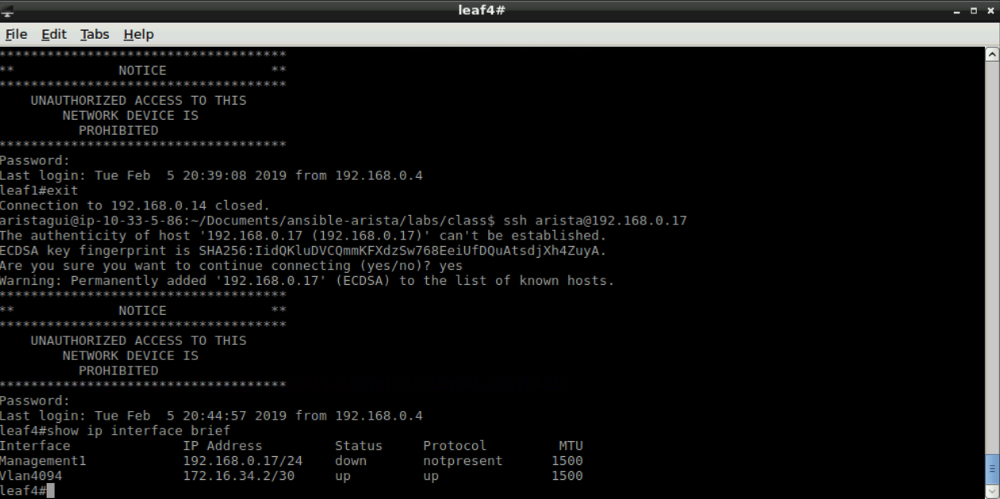

Exercise 6 - EOS L3 Interfaces
==============================

1. Next we will go over the **eos_l3_interface**.  This module allows us to create/modify L3 interfaces on a switch from a playbook.

|

2. Create a new file with the following information, and save it as ``add-l3.yml``

    .. code-block:: yaml

        ---
        - hosts: 192.168.0.17
          gather_facts: false
          tasks:
            - name: Apply L3 Interfaces to Leaf4
              eos_l3_interface:
                name: "{{ item.name }}"
                ipv4: "{{ item.ipaddress }}"
              loop: "{{ l3_intf }}"

|

3. Before we run this playbook, in **Terminal** let's login to a switch to see the current IP addreses configured on leaf4. username: ``arista`` password: ``arista``

    .. code-block:: text

        ssh arista@192.168.0.17
        show ip interface brief
        exit

|

4. Now within **Terminal** we will run this playbook.

    .. code-block:: text
    
        ansible-playbook add-l3.yml
    
5. Now let's login to the switch to see if the was created.

    .. code-block:: text

        ssh arista@192.168.0.17
        show ip interface brief
        show run | sec Ethernet
        exit

Wait! The playbook configured the Loopback0 IP, but doesn't appear to have configured Ethernet2 and Ethernet3.  It did, but since those interfaces are in a **switchport** mode, the IP addresses won't show up.

|

We will go over in the next exercise how to overcome this limitation in the module.

**Section Complete!**
