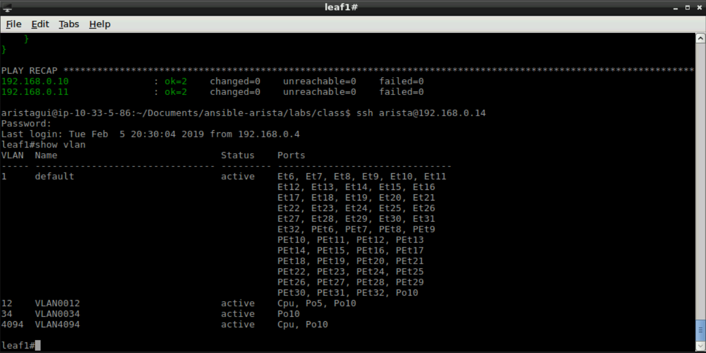
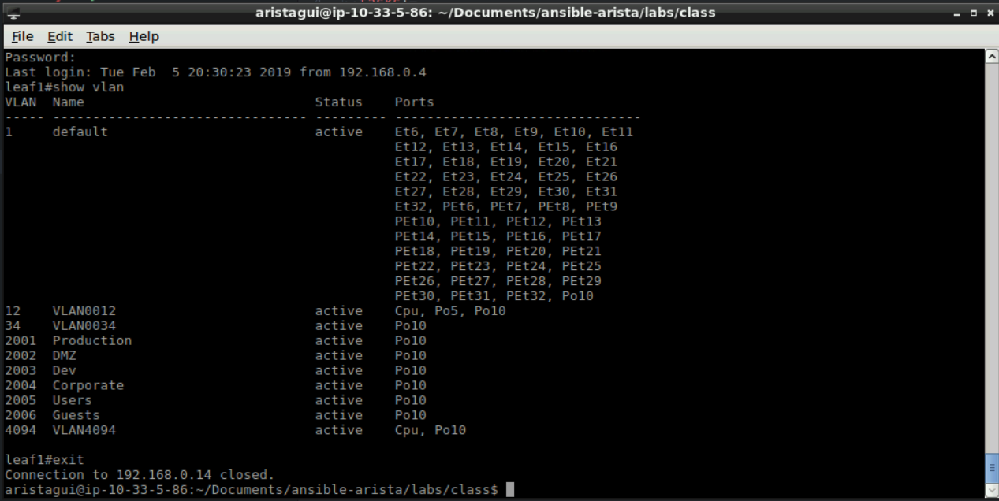

Exercise 4 - EOS VLANs
======================

1. Next we will go over the **eos_vlan** module.  This module allows vlans to be added, deleted and modified from a playbook.

2. Create a new file with the following information, and save it as ``add-vlan.yml``

    .. code-block:: yaml

        ---
        - hosts: eos-lab
          gather_facts: false
          tasks:
            - name: Add Single VLAN
              eos_vlan:
                vlan_id: 2001
                name: Production
                state: present
            - name: Add Multiple VLANS
              eos_vlan:
                aggregate: "{{ eos_vlans }}"

This playbook calls the **eos_vlan** module twice.  The first task creates a single defined VLAN.  The second task creates a set of VLANs defined in ``group_vars/all.yml``

3. Before we run this playbook, in **Terminal** let's login to a switch to see the current state of VLANs. username: ``arista`` password: ``arista``

    .. code-block:: text

        ssh arista@192.168.0.14
        show vlan
        exit

|

4. Now within **Terminal** we will run this playbook.

    .. code-block:: text
    
        ansible-playbook add-vlan.yml
    
5. Now let's login to the switch to see if the VLANs were created.

    .. code-block:: text

        ssh arista@192.168.0.14
        show vlan
        exit

|

**Section Complete!**
