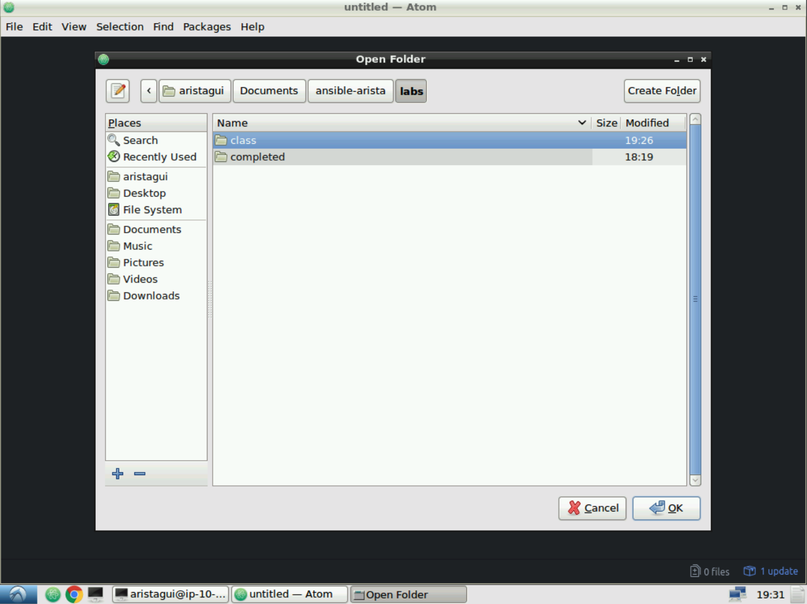
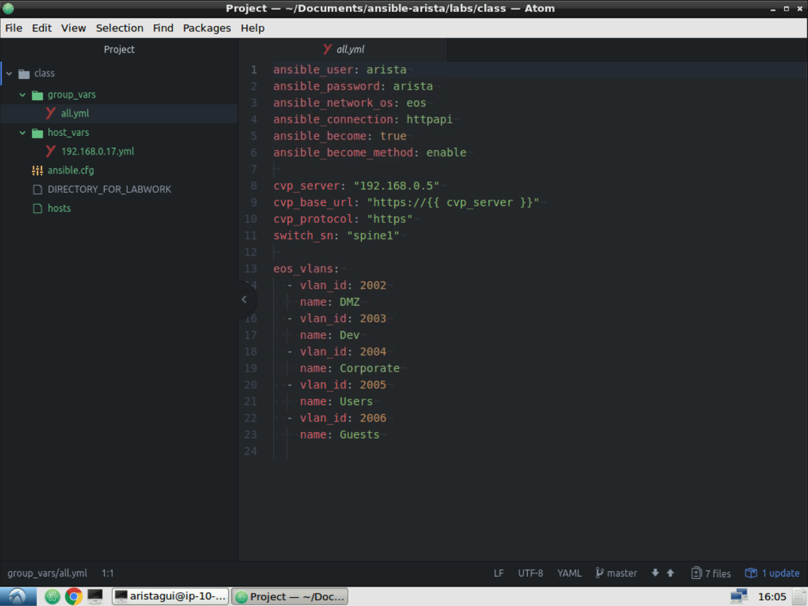

Exercise 1 - Ansible Setup
==========================

1. From the DevBox Desktop, open **Atom** from the bottom toolbar.  We will use this application to help write our Ansible playbooks and files.
 
|

2. First let's add a **Project Folder**.  Go to **File > Add Project Folder.** 

|

3. Navigate to: ``~/Documents/ansible-arista/labs/class`` and click **OK**

|

|

4. We will start with creating the Ansible configuration file.  In **Atom** enter the following information and save the file as ``ansible.cfg``

    .. code-block:: text

        [defaults]
        # Turn off Deprecation Warnings
        deprecation_warnings = False

        # Disable SSH Host Key Checking
        host_key_checking = False

        # Set Inventory File for this Project
        inventory = hosts 

        # Turn off generation of .retry files:
        retry_files_enabled = False

|

5. Create a *New File*: **File > New File** and enter the following inventory information.  Save the file as ``hosts``

    .. code-block:: text

            [spines]
            192.168.0.10
            192.168.0.11

            [leafs]
            192.168.0.1[4:7]

            [eos-lab:children]
            spines
            leafs

    .. note::
      By specifying ``192.168.0.1[4:7]`` is the same as entering each IP indivdually from 192.168.0.14 to 192.168.0.17.

|

<<<<<<< HEAD
6. Create a *New File* with the following host specific variables for leaf4.  Save the file as **host_vars/192.168.0.17.yml**
=======
6. Create a *New File* withe the following host specific variables for leaf4.  Save the file as ``host_vars/192.168.0.17.yml``
>>>>>>> Updating formatting

    .. code-block:: yaml

        l3_intf:
          - name: Ethernet2
            ipaddress: 172.16.200.14/30
          - name: Ethernet3
            ipaddress: 172.16.200.30/30
          - name: Loopback0
            ipaddress: 172.16.0.6/32

        bgp_conf:
          - neighbor: 172.16.200.13
            remote_as: 65000
          - neighbor: 172.16.200.29
            remote_as: 65000
          - neighbor: 172.16.34.1
            remote_as: 65002

|

7. Create a *New File* with the following group variables.  Save this file as ``group_vars/all.yml``

    .. code-block:: text

        ansible_user: arista
        ansible_password: arista
        ansible_network_os: eos
        ansible_connection: httpapi
        ansible_become: true
        ansible_become_method: enable

        eos_vlans:
          - vlan_id: 2002
            name: DMZ
          - vlan_id: 2003
            name: Dev
          - vlan_id: 2004
            name: Corporate
          - vlan_id: 2005
            name: Users
          - vlan_id: 2006
            name: Guests

|

|

Section Complete! 
